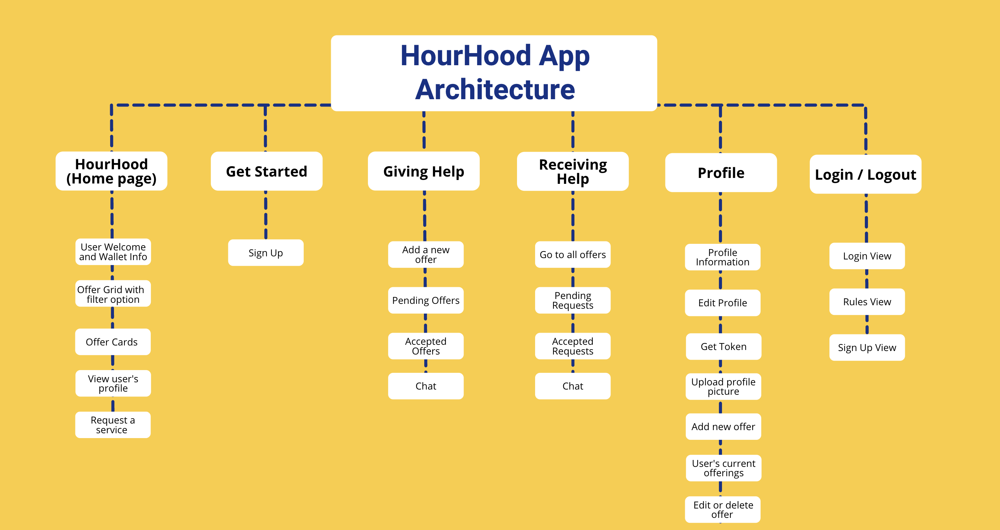
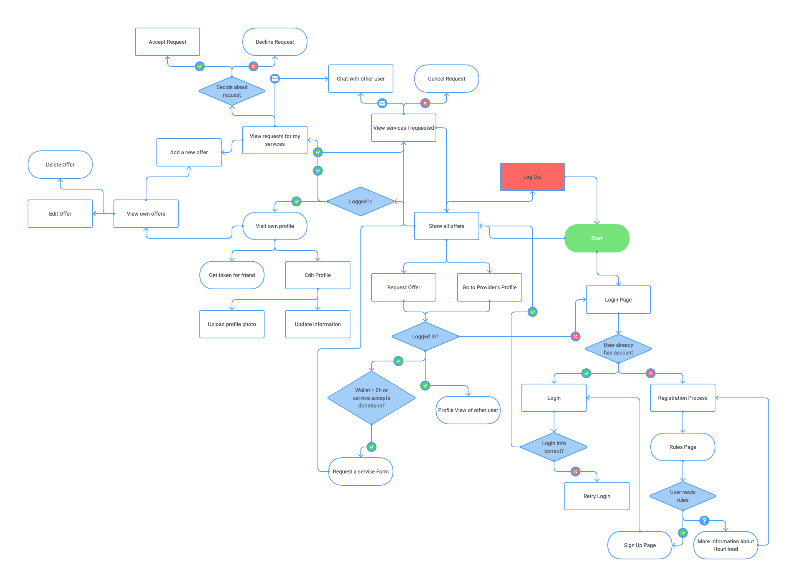
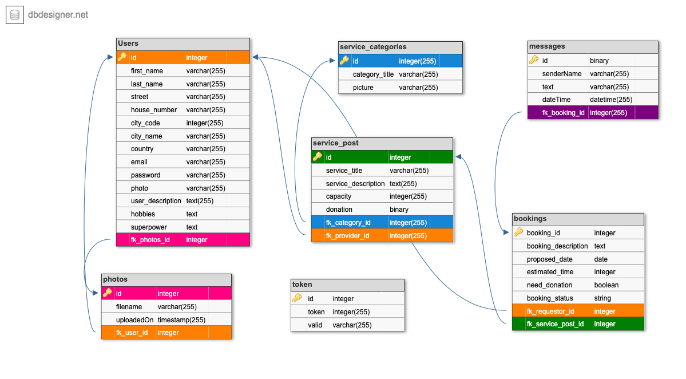

# HourHood ReadMe

## What is HourHood App about

- Hour Hood is about creating a community of neighbours who feel valued and supported by exchanging services between each other

- The app is for English speaking people who are new in Barcelona and not part of a community yet and want to find belonging and share their time with others & for people who need support in their daily life

- The main features are:

        * Offering services;
        * Booking services and answering to requests;
        * Chat between provider and requestor;

## App Architecture



## User Flow Diagram



## Database Schema




## API routes 

- to be done (https://docs.google.com/document/d/1cDTA79TO6G594Z-iBeoRcO6bpX5b7Ii_RibBdiD0btQ/edit)


## How to install and run it

### Install dependencies

- Run `npm install` in project directory, then, in terminal cd into client and run `npm install` in the client folder.

### Database Preparation

- Access your SQL CLI and type `create database HourHood;` to create a database in MySQL.

- Create `.env` file in you project directory and insert the following:

      ```
      DB_HOST=localhost
      DB_NAME=HourHood
      DB_USER=YOUR_USERNAME
      DB_PASS=YOUR_PASSWORD
      ```
- Change the DB_USER and DB_PASS to the username and password to your SQL CLI.

- Make sure to have the `.env` file included in the `.gitignore` file.

Run `npm run migrate` in your terminal in the project folder in order to create all the tables and insert data to the `HourHood` database; Use this command whenever making changes to `init_db.sql` file

### For image upload

- in public folder in project directory create a folder called `clientfiles`, then add `/public/clientfiles/` to the gitignore file

### Run Your Development Servers

- Run `npm run start` in project directory to start the Express server on port 5000
- Type `cd client` in your terminal and run `npm run start` command to start client server in development mode on port 3000.
- You can test your client app in `http://localhost:3000`

## How to use Website

- explained in Get Started Page ?

## Technologies used

### Frontend

    * Pusher
    * Tailwind
    * REACT
    * Scripts
    * React-router
    * Axios

### Backend

    * NODE.js 
    * EXPRESS
    * Postman
    * Bycript & jwt
    * dotenv
    * Multer
    * Pusher
    * Axios
    * MySQL

### API

    * Pusher

## Feature Extensions

- Update Information in real-time

- Map API integration

- Admin View

- Reviews

## Notes

_This is a student project that was created at [CodeOp](http://CodeOp.tech), a full stack development bootcamp in Barcelona._
